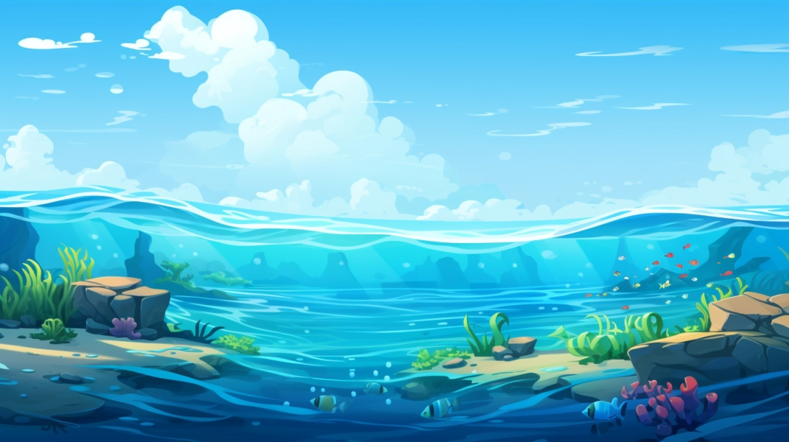

# 🐠 Fluttering Fish

Fluttering Fish is an exciting underwater adventure game where players control a fish, navigate through obstacles, and achieve the highest score possible! With multiple character options, changing backgrounds, and smooth physics-based gameplay, this game is both fun and challenging.

---

## 🎮 Game Features

- 🐟 **Choose Your Fish** – Select from different characters: Nemo, Dory, or a Whale.
- 🌊 **Dynamic Backgrounds** – The underwater world evolves as you progress.
- 🎵 **Engaging Sound Effects** – Enjoy immersive audio as you swim through obstacles.
- 🚀 **Smooth & Responsive Controls** – Jump and glide through the ocean with ease.
- 🏆 **Score Tracking** – Challenge yourself to beat your highest score!

---

## 🖥️ Installation & Setup

### 📌 Prerequisites
- Python 3.x installed
- `pygame` library installed

### 🔧 Installation Steps
1. Clone this repository:
   ```sh
   git clone https://github.com/yourusername/fluttering_fish.git
   ```
2. Navigate to the project directory:
   ```sh
   cd fluttering-fish
   ```
3. Install dependencies:
   ```sh
   pip install pygame
   ```
4. Run the game:
   ```sh
   python fish_finallll.py
   ```

---

## 🎮 How to Play?

- Press `SPACE` or `UP ARROW` to make your fish flap and move upwards.
- Avoid hitting the underwater pipes!
- The game gets harder as you progress.
- Try to get the highest score possible!

---

## 📜 Game Code

### `fish_finallll.py`
```python
import random
import sys
import pygame
from pygame.locals import *

# Global Variables for the game
FPS = 32
SCREENWIDTH = 800
SCREENHEIGHT = 600
SCREEN = pygame.display.set_mode((SCREENWIDTH, SCREENHEIGHT))
GROUNDY = SCREENHEIGHT * 0.8

# Load assets
GAME_SPRITES = {}
GAME_SOUNDS = {}
BACKGROUND = 'sprites/background1.jpg'
PIPE = 'sprites/pipe.png'
PLAYER = 'sprites/fish.png'

# Game Functions
def welcomeWindow():
    """Shows welcome screen"""
    pass  # Implement screen logic

def mainGame():
    """Main game logic"""
    pass  # Implement game logic

def isCollide():
    """Check for collision"""
    pass  # Implement collision detection

def gameOver(score):
    """Displays game over screen"""
    pass  # Implement game over screen

if __name__ == "__main__":
    pygame.init()
    FPSCLOCK = pygame.time.Clock()
    pygame.display.set_caption('FLUTTERING FISH')
    while True:
        welcomeWindow()
        mainGame()
```

---

## 📸 Screenshots



---

## 🚀 Future Improvements
- 🎭 More playable characters.
- 🌅 Additional underwater themes.
- 🏆 Leaderboard for high scores.

---

