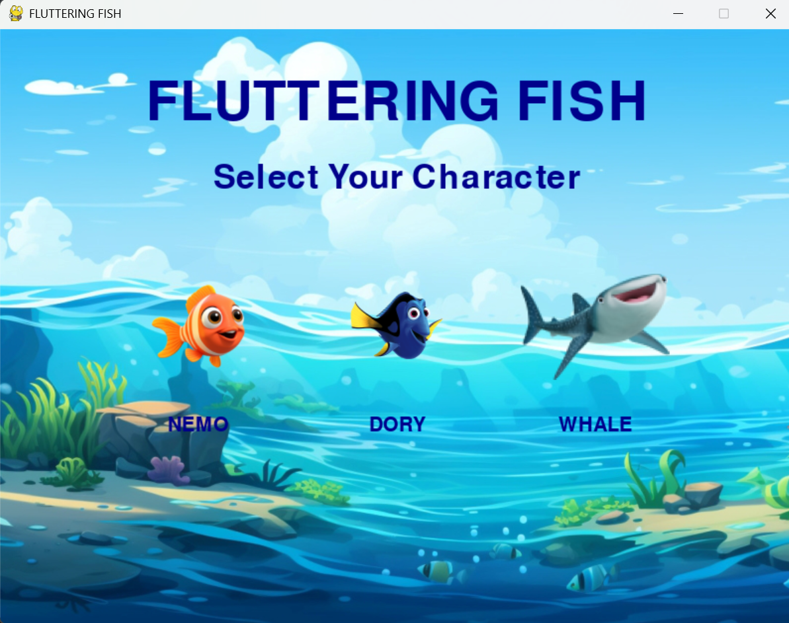
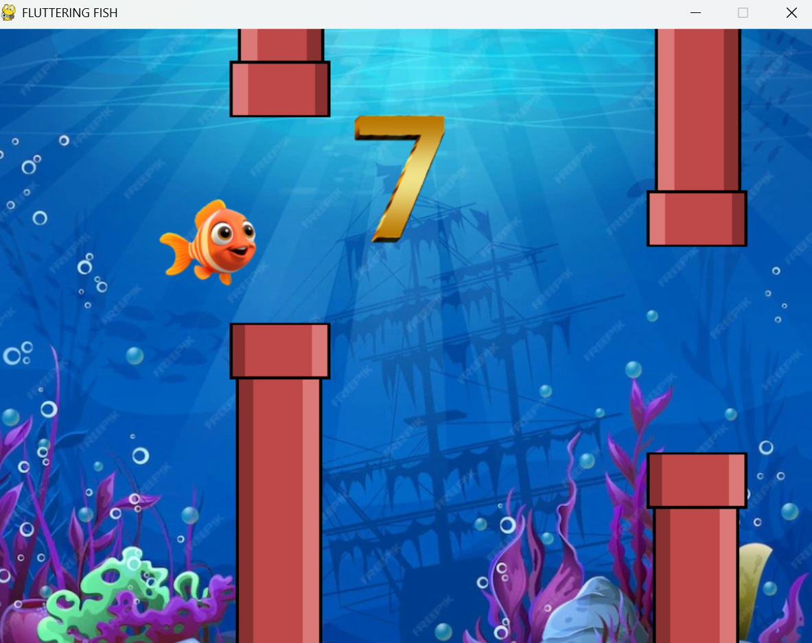
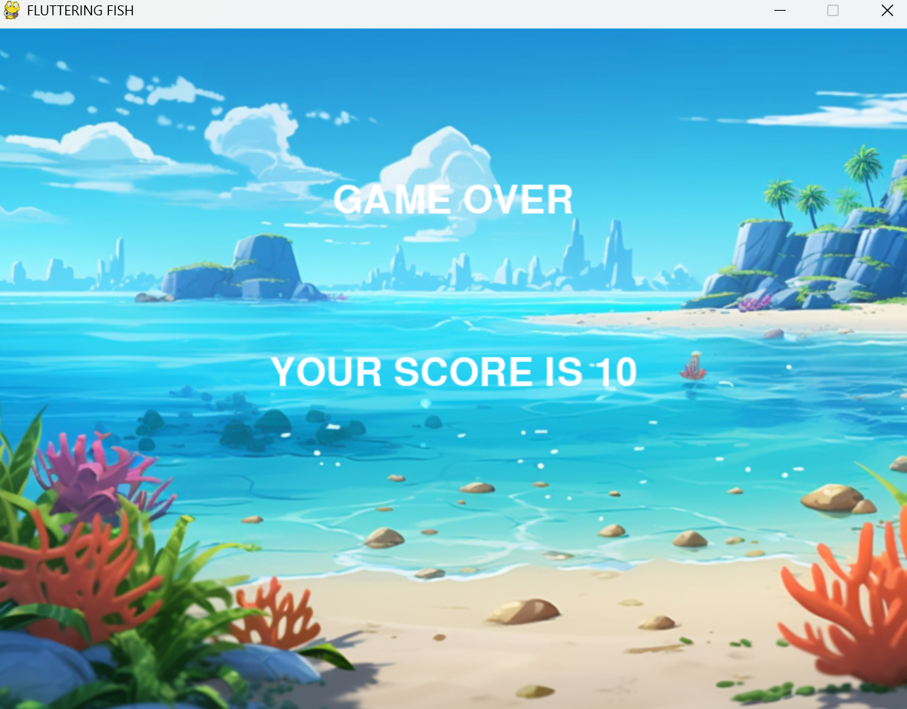

# 🐠 Fluttering Fish

Fluttering Fish is an exciting underwater adventure game where players control a fish, navigate through obstacles, and achieve the highest score possible! With multiple character options, changing backgrounds, and smooth physics-based gameplay, this game is both fun and challenging.

---

## 🎮 Game Features

- 🐟 **Choose Your Fish** – Select from different characters: Nemo, Dory, or a Whale.
- 🌊 **Dynamic Backgrounds** – The underwater world evolves as you progress.
- 🎵 **Engaging Sound Effects** – Enjoy immersive audio as you swim through obstacles.
- 🚀 **Smooth & Responsive Controls** – Jump and glide through the ocean with ease.
- 🏆 **Score Tracking** – Challenge yourself to beat your highest score!

---

## 🖥️ Installation & Setup

### 📌 Prerequisites
- Python 3.x installed
- `pygame` library installed

### 🔧 Installation Steps
1. Clone this repository:
   ```sh
   git clone https://github.com/yourusername/fluttering-fish.git
   ```
2. Navigate to the project directory:
   ```sh
   cd FLUTTERING FISH
   ```
3. Install dependencies:
   ```sh
   pip install pygame
   ```
4. Run the game:
   ```sh
   python fish_finallll.py
   ```

---

## 🎮 How to Play?

- Press `SPACE` or `UP ARROW` to make your fish flap and move upwards.
- Avoid hitting the underwater pipes!
- The game gets harder as you progress.
- Try to get the highest score possible!


---

## 📸 Screenshots

Here are some visuals of the game:





---

## 🚀 Future Improvements
- 🎭 More playable characters.
- 🌅 Additional underwater themes.
- 🏆 Leaderboard for high scores.


